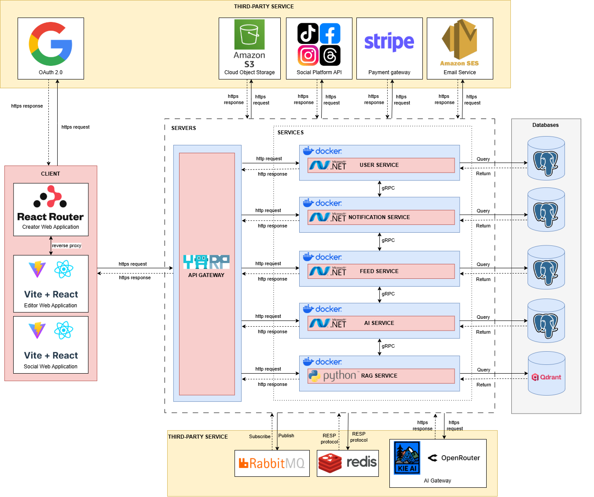

# MeAI Backend

MeAI-BE is the backend for the MeAI platform: social account connection, post library sync, AI recommendation, AI image/video generation, publishing workflows, notifications, payments, public feed, and RAG-powered account intelligence.



## What Is Inside

```text
Backend/
  Compose/                         # Local Docker Compose stacks and seed data
  Kubernetes/                      # Local Kubernetes manifests
  Microservices/
    ApiGateway/                    # YARP gateway
    User.Microservice/             # auth, users, OAuth, workspaces, billing, storage
    Ai.Microservice/               # AI generation, recommendations, posts, publish flows
    Feed.Microservice/             # public feed, profiles, analytics, comments
    Notification.Microservice/     # notifications API and SignalR hub
    Rag.Microservice/              # Python RAG service: LightRAG, visual RAG, VideoRAG
    SharedLibrary/                 # shared contracts, auth, middleware, protobuf files
Terraform/                         # AWS infrastructure root and modules
Terraform-vars/                    # active Terraform variable set; may contain local secrets
terraform-var/                     # read-only source variable set
.github/workflows/                 # deploy, update-images, nuke, and Terraform workflows
```

## Architecture

The backend is a microservice system behind `ApiGateway`.

| Service | Tech | Responsibility |
|---|---|---|
| `ApiGateway` | .NET / YARP | Routes `/api/User`, `/api/Ai`, `/api/AiGeneration`, `/api/Feed`, `/api/Notification`; exposes aggregated API docs. |
| `User.Microservice` | .NET | Auth, Google login, social OAuth, account metadata, workspaces, subscriptions, storage resource ownership. |
| `Ai.Microservice` | .NET | AI chats, draft posts, recommendations, post builder, publishing, Kie/Veo callbacks, RAG orchestration. |
| `Feed.Microservice` | .NET | Public MeAI social feed, profiles, posts, comments, analytics and seed data. |
| `Notification.Microservice` | .NET | Notification persistence, REST APIs, SignalR realtime hub. |
| `Rag.Microservice` | Python | Text RAG, image RAG, VideoRAG, account post ingest, knowledge bootstrap. |

Infrastructure dependencies:

- PostgreSQL for service databases.
- Qdrant for RAG vectors.
- RabbitMQ for async events and RAG RPC.
- Redis for cache/coordination.
- S3-compatible object storage for media and RAG image mirroring.
- OpenRouter/Kie/Gemini/Jina/Brave for AI, embeddings, rerank and search.
- Facebook, Instagram, Threads, TikTok, Google, Stripe and email providers for external integrations.
