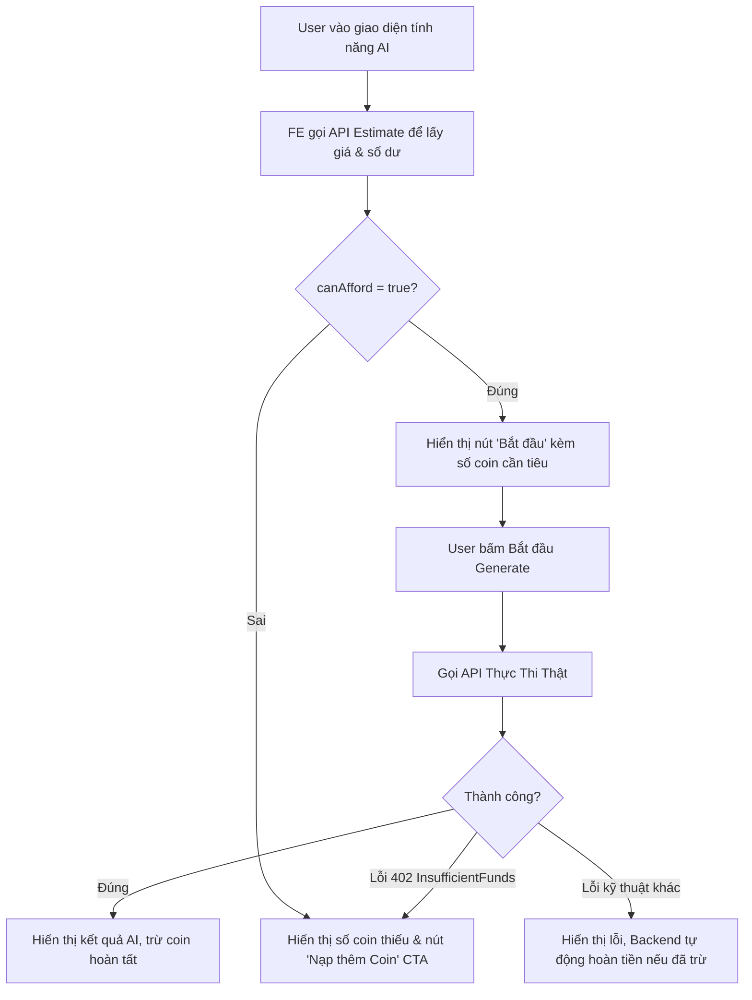

# Hướng Dẫn Tính Toán (Estimate) Coin & Toàn Bộ Cấu Hình AI Generation

Tài liệu này cung cấp hướng dẫn đầy đủ và chi tiết nhất dành cho đội ngũ phát triển Frontend (FE) để triển khai tính năng ước lượng phí (estimate coin), hiển thị số dư, xử lý thiếu coin (top-up) và tích hợp tất cả các tác vụ AI (AI Generation) trên hệ thống MeAI.

---

## 1. Tổng Quan Kiến Trúc & Luồng Tích Hợp

Để tối ưu trải nghiệm người dùng, hệ thống MeAI bắt buộc phải hiển thị chi phí ước lượng (bằng Coin) ngay trên nút bấm hoặc giao diện trước khi người dùng thực sự kích hoạt một tác vụ AI (như viết bài, tạo ảnh, sinh video...).

### Luồng Tích Hợp Đề Xuất (Frontend Flow)



### Các Nguyên Tắc Vận Hành Quan Trọng
1. **Không Hardcode Giá ở FE**: Tất cả mức giá (coin) hiển thị phải được lấy động qua API Estimate hoặc API lấy danh mục giá công khai (`GET /api/Ai/coin-pricing`).
2. **Ước Lượng Không Trừ Coin**: Các API `/estimate` là API đọc thông tin (Read-only), hoàn toàn không trừ coin của tài khoản.
3. **Cơ Chế Khóa & Hoàn Tiền (Refund)**: Khi gọi API thực thi thật, hệ thống sẽ thực hiện trừ coin tạm tính (lock & debit). Nếu tiến trình xử lý của bên thứ ba (Kie, Veo, OpenRouter) thất bại, Backend sẽ tự động thực hiện lệnh hoàn tiền (refund) 100% về tài khoản của user và cập nhật trạng thái giao dịch.

---

## 2. Các API Ước Lượng (Estimate) Coin

FE có thể ước lượng coin thông qua hai endpoint chính tùy vào ngữ cảnh:

### Cách A: Ước lượng theo Nghiệp Vụ Cụ Thể (High-Level Estimate)
Dành riêng cho màn hình soạn thảo bài viết/caption. FE chỉ cần truyền tên nghiệp vụ (`operation`), hệ thống tự động suy luận model và cấu hình tương ứng.

* **Endpoint**: `POST /api/AiGeneration/estimate`
* **Headers**: `Authorization: Bearer <Token>`
* **Request Body**:
  ```json
  {
    "operation": "captions" // Hoặc "post", "post-prepare"
  }
  ```
  *(Các alias được chấp nhận ở cột dưới)*:
  * `captions`: "caption", "captions"
  * `post`: "post", "gemini-post", "draft-post"
  * `post-prepare`: "post-prepare", "prepare-post", "prepare-posts"

* **Response (Thành công - Đủ Coin)**:
  ```json
  {
    "isSuccess": true,
    "value": {
      "operation": "captions",
      "actionType": "caption_generation",
      "model": "openai/gpt-4o",
      "variant": null,
      "unit": "per_platform",
      "unitCostCoins": 3.00,
      "quantity": 1,
      "totalCoins": 3.00,
      "currentBalance": 100.00,
      "canAfford": true,
      "shortfallCoins": 0.00
    },
    "error": { "code": "", "description": "", "metadata": null }
  }
  ```

* **Response (Thành công - Thiếu Coin)**:
  ```json
  {
    "isSuccess": true,
    "value": {
      "operation": "post",
      "actionType": "caption_generation",
      "model": "gpt-4o-mini",
      "variant": null,
      "unit": "per_platform",
      "unitCostCoins": 2.00,
      "quantity": 1,
      "totalCoins": 2.00,
      "currentBalance": 0.00,
      "canAfford": false,
      "shortfallCoins": 2.00 // Số coin cần nạp thêm
    },
    "error": { "code": "", "description": "", "metadata": null }
  }
  ```

---

### Cách B: Định giá Chung theo Cấu Hình Catalog (Generic Pricing Estimate)
Dùng cho tất cả các tính năng AI khác (Chat, Sinh Ảnh, Sinh Video, Tạo Công thức...). FE truyền trực tiếp cấu hình kỹ thuật để nhận báo giá chính xác.

* **Endpoint**: `POST /api/Ai/coin-pricing/estimate`
* **Headers**: `Authorization: Bearer <Token>`
* **Request Body**:
  ```json
  {
    "actionType": "image_generation",
    "model": "nano-banana-pro",
    "variant": "1K",
    "quantity": 2
  }
  ```
* **Response (Báo giá thô, không kèm số dư ví)**:
  ```json
  {
    "isSuccess": true,
    "value": {
      "actionType": "image_generation",
      "model": "nano-banana-pro",
      "variant": "1K",
      "unit": "per_image",
      "unitCostCoins": 157.85,
      "quantity": 2,
      "totalCoins": 315.70
    },
    "error": { "code": "", "description": "", "metadata": null }
  }
  ```

---

## 3. Bảng Tra Cứu Toàn Bộ Các ActionType Đầy Đủ (Full Catalog Map)

Dưới đây là bảng ánh xạ chi tiết 1:1 từ **Giao Diện Frontend** -> **Tham Số Estimate** -> **API Thực Thi Thật trên Server** để FE dễ dàng áp dụng:

| Tên Tính Năng (Frontend Feature) | Loại Tác Vụ (`actionType`) | Model Mặc Định (`model`) | Biến Thể (`variant`) | Đơn Vị Tính (`unit`) | Tham Số Số Lượng (`quantity`) | API Thực Thi Thật (Real Execution API) | Tham Số Cần Gửi Khi Thực Thi (Real Body Elements) |
| :--- | :--- | :--- | :--- | :--- | :--- | :--- | :--- |
| **Sinh ảnh từ văn bản (Chat Image)** | `image_generation` | `nano-banana-pro` (hoặc `ideogram/v3-text-to-image`) | `1K`, `2K` hoặc `null` | `per_image` | Số lượng ảnh yêu cầu (ví dụ: `4`) | `POST /api/Ai/chats/image` | `chatSessionId`, `prompt`, `model`, `aspectRatio`, `resolution` (1K/2K), `numberOfVariances` (tương ứng quantity) |
| **Sinh biến thể ảnh / Reframe ảnh** | `image_reframe_variant` | `nano-banana-pro` (hoặc wildcard `*`) | `null` | `per_variant` | Số lượng biến thể sinh ra | `POST /api/Ai/chats/image` *(chế độ reframe)* | `chatSessionId`, `prompt`, `resourceIds` (chứa ảnh gốc), `aspectRatio`, `resolution` |
| **Short video generation (Chat Video)** | `video_generation` | `gemini-omni-video`, `grok-imagine-video-1-5-preview`, `veo-3-1`, or `bytedance/seedance-2` | `resolution:duration` for Gemini Omni and Grok; resolution for Seedance; `lite`, `fast`, `quality` for `veo-3-1` | `per_clip` or `per_second` | Clip count, or selected duration in seconds for Seedance | `POST /api/Ai/chats/video` | `chatSessionId`, `prompt`, `model`, `variant`, `aspectRatio`, `seeds`, `generationType`, `resolution`, `duration`, `generateAudio`, `returnLastFrame`, `webSearch` |
| **Tạo Caption Đồng Loạt (Batch Captions)** | `caption_generation` | `openai/gpt-4o` | `null` | `per_platform` | Số lượng nền tảng tích hợp được chọn | `POST /api/AiGeneration/captions` | `postId` (Guid), `platform` (ví dụ: `"facebook"`), `language`, `style`, `resourceIds` |
| **Tạo Bài Đăng Gemini (Gemini Post)** | `caption_generation` | Config theo user hoặc mặc định `gpt-4o-mini` | `null` | `per_platform` | `1` | `POST /api/AiGeneration/post` | `workspaceId`, `resourceIds`, `caption`, `postType`, `language`, `instruction` |
| **Chuẩn Bị Bài Đăng (Post Prepare)** | Không gọi catalog | `none` | `null` | `per_request` | `1` (Miễn phí - 0 Coin) | `POST /api/AiGeneration/post-prepare` | `workspaceId`, `resourceIds`, `socialMedia` |
| **Cải Thiện Bài Đăng (Improve Post)** | `post_enhancement` | `openrouter/improve-post-v1` | `caption`, `image` hoặc `caption_image` | `per_request` | `1` | `POST /api/Ai/recommendations/posts/{postId}/improve` | `improveCaption` (bool), `improveImage` (bool), `style`, `platform`, `userInstruction` |
| **Tạo Bản Nháp RAG (Draft Post Gen)** | `draft_post_generation` | `openrouter/draft-post-v1` | `null` | `per_draft` | `1` | `POST /api/Ai/recommendations/{socialMediaId}/draft-posts` | `userPrompt`, `style`, `workspaceId`, `topK`, `maxReferenceImages`, `maxRagPosts` |
| **Viết Bài Theo Công Thức (AIDA/PAS/FAB...)** | `formula_generation` | `gpt-4o-mini` | `null` | `per_variant` | Số biến thể yêu cầu sinh (`variantCount` từ 1 - 5) | `POST /api/Ai/formulas/generate` | `formulaId` hoặc `formulaKey`, `template`, `variables` (Object), `outputType` (caption/hook/cta/outline/custom), `variantCount` (tương ứng quantity) |

---

## 4. Chi Tiết Từng Loại ActionType (Deep-dive)

Dưới đây là hướng dẫn chi tiết cách cấu hình payload để gọi estimate cho từng tính năng AI cụ thể:

### 4.1. Tác vụ: Sinh ảnh AI (`image_generation`)
Sử dụng trên các màn hình tạo ảnh nghệ thuật, tạo ảnh minh họa bài viết, hoặc sinh ảnh trực tiếp trong khung chat.

* **Cấu hình định giá mặc định**:
  * Model `nano-banana-pro` + Variant `1K`: ~157.85 Coins / ảnh.
  * Model `nano-banana-pro` + Variant `2K`: ~315.71 Coins / ảnh.
  * Model `ideogram/v3-text-to-image` + Variant `1K`: ~420.94 Coins / ảnh.
  * Model `ideogram/v3-text-to-image` + Variant `2K`: ~631.42 Coins / ảnh.
  * Fallback Wildcard (`*`): ~263.09 Coins / ảnh.

* **Payload gửi lên `/api/Ai/coin-pricing/estimate`**:
  ```json
  {
    "actionType": "image_generation",
    "model": "nano-banana-pro", // Hoặc "ideogram/v3-text-to-image"
    "variant": "1K",            // Hoặc "2K", null
    "quantity": 4               // Số lượng ảnh muốn sinh
  }
  ```

---

### 4.2. Tác vụ: Tạo Biến Thể Ảnh / Thay Đổi Khung Hình (`image_reframe_variant`)
Sử dụng khi người dùng chọn một ảnh đã có, yêu cầu thay đổi tỷ lệ khung hình (ví dụ: chuyển từ 1:1 sang 16:9) hoặc sinh các góc nhìn khác dựa trên ảnh gốc.

* **Cấu hình định giá mặc định**:
  * Model `nano-banana-pro` + Variant `null`: ~157.85 Coins / ảnh biến thể.
  * Fallback Wildcard (`*`): ~263.09 Coins / ảnh biến thể.

* **Payload gửi lên `/api/Ai/coin-pricing/estimate`**:
  ```json
  {
    "actionType": "image_reframe_variant",
    "model": "nano-banana-pro",
    "variant": null,
    "quantity": 1
  }
  ```

---

### 4.3. Tác vụ: Sinh Video AI (`video_generation`)
Sử dụng trong tính năng tạo video clip ngắn từ prompt chữ hoặc từ ảnh nguồn.

* **Cấu hình định giá mặc định**:
  * Model `gemini-omni-video` + Variant `720p:4s`, `720p:6s`, `720p:8s`, `720p:10s`: ~11.84, 15.79, 19.73, 23.68 Coins / clip.
  * Model `gemini-omni-video` + Variant `1080p:4s`, `1080p:6s`, `1080p:8s`, `1080p:10s`: ~11.84, 15.79, 19.73, 23.68 Coins / clip.
  * Model `gemini-omni-video` + Variant `4k:4s`, `4k:6s`, `4k:8s`, `4k:10s`: ~27.62, 31.57, 35.52, 39.46 Coins / clip.
  * Model `grok-imagine-video-1-5-preview` + Variant `480p:{duration}s`: ~`((0.08 × duration) + 0.01) × 26.309` Coins / clip.
  * Model `grok-imagine-video-1-5-preview` + Variant `720p:{duration}s`: ~`((0.14 × duration) + 0.01) × 26.309` Coins / clip.
  * Model `veo-3-1` + Variant `lite`: ~3.95 Coins / clip.
  * Model `veo-3-1` + Variant `fast`: ~7.89 Coins / clip.
  * Model `veo-3-1` + Variant `quality`: ~32.89 Coins / clip.
  * Model `bytedance/seedance-2` + Variant `480p`: ~2.50 Coins / giây.
  * Model `bytedance/seedance-2` + Variant `720p`: ~5.39 Coins / giây.
  * Model `bytedance/seedance-2` + Variant `1080p`: ~13.42 Coins / giây.
  * Fallback Wildcard (`*`): ~31.57 Coins / clip.

  Các dòng `variant = null` cũ vẫn được giữ để tương thích ngược. Luồng FE mới dùng `resolution:duration` làm `variant` cho Gemini Omni và Grok. Với Grok, giá clip gồm phí output theo giây và phí cố định 1 ảnh nguồn. Seedance dùng resolution làm `variant` và duration làm `quantity`.

  Catalog giá được seed vào database và có thể chỉnh qua admin. Backend không gọi API Kie để lấy giá realtime. Snapshot quy đổi hiện tại dùng `1 Coin ~= 1,000 VND`, tương đương `100,000 VND = 100 Coins`.

* **Duration và ảnh tham chiếu theo model**:
  * `gemini-omni-video`: `4`, `6`, `8`, `10` giây; tối đa 7 ảnh tham chiếu.
  * `grok-imagine-video-1-5-preview`: `1-15` giây; đúng 1 ảnh nguồn.
  * `veo-3-1`: clip trực tiếp cố định 8 giây; ảnh đầu/cuối hoặc tối đa 3 ảnh material reference khi dùng tier Fast.
  * `bytedance/seedance-2`: `4-15` giây; ảnh đầu/cuối hoặc tối đa 9 ảnh tham chiếu, hai chế độ không được dùng chung.

* **Payload gửi lên `/api/Ai/coin-pricing/estimate`**:
  ```json
  {
    "actionType": "video_generation",
    "model": "veo-3-1",
    "variant": "fast", // Or "lite", "quality"
    "quantity": 1
  }
  ```

---

### 4.4. Tác vụ: Viết Caption Bài Đăng Mạng Xã Hội (`caption_generation`)
Sử dụng tại màn hình soạn thảo bài đăng, viết caption tự động hàng loạt cho đa kênh mạng xã hội.

* **Cấu hình định giá mặc định**:
  * Model `openai/gpt-4o` + Variant `null`: ~39.46 Coins / mạng xã hội.
  * Model `gpt-4o-mini` + Variant `null`: ~2.10 Coins / mạng xã hội.
  * Model `gpt-5-2` + Variant `null`: ~2.63 Coins / mạng xã hội.
  * Fallback Wildcard (`*`): ~2.63 Coins / mạng xã hội.

> [!TIP]
> Đối với tính năng này, FE nên ưu tiên dùng API nghiệp vụ cụ thể `POST /api/AiGeneration/estimate` với `operation = "captions"` hoặc `"post"`.

* **Payload gửi lên `/api/Ai/coin-pricing/estimate` (Nếu dùng dạng Generic)**:
  ```json
  {
    "actionType": "caption_generation",
    "model": "openai/gpt-4o",
    "variant": null,
    "quantity": 3 // Ví dụ đăng lên Facebook, Instagram, TikTok (3 nền tảng)
  }
  ```

---

### 4.5. Tác vụ: Cải Thiện Bài Đăng Có Sẵn (`post_enhancement`)
Sử dụng khi người dùng bấm vào một bài viết có sẵn và yêu cầu AI cải thiện: viết lại caption hay hơn, tạo hình ảnh minh họa mới phù hợp hơn, hoặc tối ưu hóa đồng thời cả chữ và ảnh.

* **Cấu hình định giá mặc định (Model nâng cao)**:
  * Model `openrouter/improve-post-v1` + Variant `"caption"` (chỉ sửa chữ): ~39.46 Coins.
  * Model `openrouter/improve-post-v1` + Variant `"image"` (chỉ sửa ảnh): ~615.63 Coins.
  * Model `openrouter/improve-post-v1` + Variant `"caption_image"` (sửa cả hai): ~655.09 Coins.
* **Cấu hình định giá mặc định (Model thông thường)**:
  * Model `gpt-4o-mini` hoặc `gpt-5-2` + Variant `null`: ~2.10 - 2.63 Coins / mạng xã hội.

* **Payload gửi lên `/api/Ai/coin-pricing/estimate`**:
  ```json
  {
    "actionType": "post_enhancement",
    "model": "openrouter/improve-post-v1",
    "variant": "caption_image", // Cực kỳ quan trọng: gửi đúng option của user chọn sửa
    "quantity": 1
  }
  ```

---

### 4.6. Tác vụ: Sinh Bài Viết Nháp Tự Động Từ RAG (`draft_post_generation`)
Sử dụng ở màn hình Đề Xuất Chiến Dịch / Bài Đăng Tự Động. Hệ thống sẽ phân tích tệp dữ liệu đã học (RAG) và đề xuất ý tưởng + sinh bài đăng nháp hoàn chỉnh cả chữ lẫn ảnh.

* **Cấu hình định giá mặc định**:
  * Model `openrouter/draft-post-v1` + Variant `null`: ~615.63 Coins.
  * Fallback Wildcard (`*`): ~615.63 Coins.

* **Payload gửi lên `/api/Ai/coin-pricing/estimate`**:
  ```json
  {
    "actionType": "draft_post_generation",
    "model": "openrouter/draft-post-v1",
    "variant": null,
    "quantity": 1
  }
  ```

---

### 4.7. Tác vụ: Sinh Bài Viết Theo Công Thức Marketing (`formula_generation`)
Sử dụng ở màn hình viết bài theo công thức Marketing chuẩn (AIDA, PAS, BAB, FAB...). Cho phép người dùng sinh nhiều biến thể (variants) cùng lúc.

* **Cấu hình định giá mặc định**:
  * Model `gpt-4o-mini` + Variant `null`: ~1.05 Coins / biến thể đầu ra.
  * Fallback Wildcard (`*`): ~1.05 Coins / biến thể đầu ra.

* **Payload gửi lên `/api/Ai/coin-pricing/estimate`**:
  ```json
  {
    "actionType": "formula_generation",
    "model": "gpt-4o-mini",
    "variant": null,
    "quantity": 3 // User yêu cầu sinh 3 tùy chọn (variants) khác nhau
  }
  ```

---

## 5. Hướng Dẫn Xử Lý Lỗi & Tích Hợp Giao Diện

Khi thực hiện lệnh generate thật bằng cách gửi Request lên các API thực thi bài viết/hình ảnh/video, FE cần thiết lập cơ chế bắt lỗi tập trung:

### Định Dạng Lỗi Thiếu Coin (HTTP Status 402)
Nếu tài khoản người dùng không đủ coin để thực hiện tác vụ, hệ thống trả về mã trạng thái **`402 Payment Required`** với cấu trúc lỗi chuẩn như sau:

```http
HTTP/1.1 402 Payment Required
Content-Type: application/problem+json
```
```json
{
  "status": 402,
  "type": "Billing.InsufficientFunds",
  "detail": "Insufficient MeAI coins."
}
```

### Cách Xử Lý Lỗi Tập Trung (Ví dụ Javascript/Axios Interceptor)
FE nên chặn mã lỗi `402` ở tầng HTTP client để tự động mở cửa sổ Top-up (Nạp Coin) thay vì chỉ hiển thị một thông báo đỏ thông thường.

```javascript
import axios from 'axios';

const apiClient = axios.create({
  baseURL: '/api'
});

apiClient.interceptors.response.use(
  (response) => response,
  (error) => {
    if (error.response && error.response.status === 402) {
      const errorDetail = error.response.data;
      if (errorDetail.type === 'Billing.InsufficientFunds') {
        // Kích hoạt Event hoặc hàm mở Top-up Modal trên giao diện FE
        triggerTopUpModal({
          message: 'Tài khoản của bạn không đủ Coin để thực hiện tác vụ AI này.',
          requiredAction: errorDetail.detail
        });
      }
    }
    return Promise.reject(error);
  }
);
```

---

## 6. Lời Khuyên Cho Nhà Phát Triển Frontend

1. **Tối ưu hóa số lượt gọi Estimate**: Chỉ nên gọi API Estimate khi user mở màn hình tính năng AI tương ứng, hoặc khi thay đổi các cấu hình quan trọng (chuyển đổi độ phân giải từ 1K sang 2K, tăng số lượng ảnh cần tạo, chọn thêm mạng xã hội...). Tránh gọi liên tục trên mỗi ký tự nhập vào input text.
2. **Hiển thị Số Dư Trực Quan**: Hãy đặt số dư ví hiện tại của người dùng ở góc trên cùng của thanh điều hướng (Navbar) hoặc ngay cạnh nút Generate để tăng tính minh bạch và khuyến khích nạp tiền.
3. **Sử dụng đúng `variant` cho `post_enhancement`**: Khi tích hợp tính năng Cải Thiện Bài Viết (Improve Post), hãy kiểm tra kỹ trạng thái của hai nút toggle `Improve Caption` và `Improve Image` trên màn hình để gửi đúng `variant` (`caption`, `image` hoặc `caption_image`) khi gọi ước lượng và thực thi. Gửi sai variant sẽ dẫn tới tính sai số coin dự kiến của người dùng.
