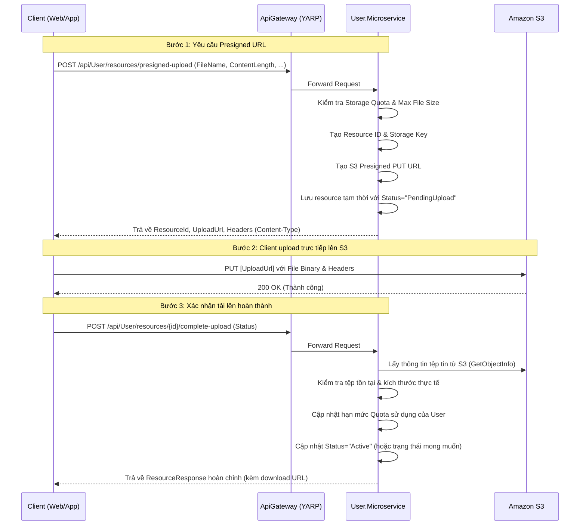

# Hướng dẫn Tải lên Trực tiếp qua S3 Presigned Upload URL

Tài liệu này hướng dẫn cách sử dụng API tạo đường dẫn tải lên trước (Presigned Upload URL) để cho phép phía client tải các tệp tin có dung lượng lớn trực tiếp lên Amazon S3, bỏ qua các giới hạn băng thông và giới hạn kích thước tệp tin của API Gateway và Kestrel Web Server.

---

## 1. Vấn đề Giới hạn Tải lên Hiện tại

Hệ thống hiện tại có các cấu hình giới hạn kích thước HTTP request body:
- **Kestrel Web Server (mặc định của .NET)**: Giới hạn tối đa là **~28.6 MB** (`MaxRequestBodySize`).
- **ApiGateway (YARP Reverse Proxy)**: Giới hạn tối đa là **100 MB**.

Đối với các tệp tin lớn hơn (ví dụ: video hoặc tài nguyên đồ họa lớn lên tới 500 MB cho gói trả phí), việc truyền dữ liệu qua API Gateway và Kestrel sẽ bị từ chối ngay lập tức bởi máy chủ web hoặc proxy với mã lỗi HTTP 413 (Payload Too Large).

---

## 2. Giải pháp: Tải lên Trực tiếp S3 (Direct Upload)

Để giải quyết vấn đề này, quy trình tải lên được chia làm 3 bước:



---

## 3. Chi tiết Tích hợp API

### Bước 1: Khởi tạo tải lên (Initiate Upload)

Client gửi yêu cầu khởi tạo đến backend kèm theo kích thước tệp tin ước tính và kiểu nội dung để hệ thống kiểm tra trước dung lượng lưu trữ (quota) còn lại của người dùng.

- **Endpoint**: `POST /api/User/resources/presigned-upload`
- **Headers**:
  - `Authorization: Bearer <token>`
  - `Content-Type: application/json`
- **Request Body**:
  ```json
  {
    "fileName": "demo_video.mp4",
    "contentType": "video/mp4",
    "contentLength": 104857600, 
    "resourceType": "video",
    "workspaceId": "01900000-0000-0000-0000-000000000000" 
  }
  ```
- **Response (200 OK)**:
  ```json
  {
    "isSuccess": true,
    "value": {
      "resourceId": "01901000-1234-5678-abcd-ef0123456789",
      "uploadUrl": "https://meai-bucket.s3.amazonaws.com/resources/user-id/resource-id?AWSAccessKeyId=...",
      "storageKey": "resources/user-id/resource-id",
      "method": "PUT",
      "headers": {
        "Content-Type": "video/mp4"
      }
    }
  }
  ```

---

### Bước 2: Client Tải lên trực tiếp S3

Client sử dụng phương thức **PUT** và URL được trả về từ Bước 1 để thực hiện tải dữ liệu.

> [!IMPORTANT]
> Client **bắt buộc** phải truyền chính xác các Headers được trả về trong trường `headers` ở Bước 1 (đặc biệt là `Content-Type`). Nếu không khớp, S3 sẽ trả về mã lỗi `403 Forbidden (SignatureDoesNotMatch)`.

**Ví dụ bằng cURL**:
```bash
curl -X PUT "https://meai-bucket.s3.amazonaws.com/resources/user-id/resource-id?AWSAccessKeyId=..." \
     -H "Content-Type: video/mp4" \
     --data-binary @demo_video.mp4
```

**Ví dụ bằng JavaScript (Fetch API)**:
```javascript
const uploadUrl = responseFromStep1.value.uploadUrl;
const requiredHeaders = responseFromStep1.value.headers;

const file = document.getElementById('file-input').files[0];

const uploadResponse = await fetch(uploadUrl, {
  method: 'PUT',
  headers: {
    ...requiredHeaders,
  },
  body: file
});

if (uploadResponse.ok) {
  console.log("Tải lên S3 thành công!");
}
```

---

### Bước 3: Xác nhận hoàn thành tải lên (Complete Upload)

Sau khi tệp đã được tải thành công lên S3, client **phải** gửi một thông báo xác nhận đến API Backend. API sẽ xác minh sự tồn tại của tệp trên S3, lấy kích thước thực tế để đối soát lại quota và kích hoạt tài nguyên trong cơ sở dữ liệu.

- **Endpoint**: `POST /api/User/resources/{resourceId}/complete-upload`
- **Headers**:
  - `Authorization: Bearer <token>`
  - `Content-Type: application/json`
- **Request Body** (Không bắt buộc):
  ```json
  {
    "status": "Active" 
  }
  ```
- **Response (200 OK)**:
  Trả về thông tin chi tiết của Resource kèm theo đường dẫn tải xuống (download link) tạm thời:
  ```json
  {
    "isSuccess": true,
    "value": {
      "id": "01901000-1234-5678-abcd-ef0123456789",
      "workspaceId": "01900000-0000-0000-0000-000000000000",
      "link": "https://meai-bucket.s3.amazonaws.com/resources/user-id/resource-id?AWSAccessKeyId=...",
      "status": "Active",
      "resourceType": "video",
      "contentType": "video/mp4",
      "sizeBytes": 104857600,
      "originKind": "user_upload",
      "createdAt": "2026-05-20T07:40:00Z",
      "updatedAt": "2026-05-20T07:43:00Z"
    }
  }
  ```

---

## 4. Cơ chế Bảo mật và Ràng buộc Quota

1. **Kiểm tra Quota trước (Pre-check)**: Ở Bước 1, nếu kích thước tệp ước tính vượt quá giới hạn dung lượng khả dụng của người dùng, hệ thống sẽ trả về lỗi `Resource.StorageQuotaExceeded` ngay lập tức mà không tạo URL để tránh lãng phí tài nguyên.
2. **Kiểm tra Đối soát kích thước thực tế (Post-check & Auto Clean)**: 
   Ở Bước 3, backend sẽ thực hiện truy vấn metadata của tệp trực tiếp từ S3:
   - Nếu tệp không tồn tại: Trả về lỗi `Resource.UploadNotFinished`.
   - Nếu kích thước thực tế khác kích thước ước tính: Hệ thống tính toán độ lệch (delta). Nếu dung lượng tăng thêm vượt quá giới hạn quota của người dùng, backend sẽ **tự động xóa tệp đã upload trên S3**, đồng thời xóa placeholder resource trong database và trả về lỗi vượt quota.
3. **Phân tách Tài nguyên tạm thời**: Các tài nguyên chưa hoàn tất Bước 3 (Status = `"PendingUpload"`) sẽ tự động bị loại khỏi danh sách truy vấn thư viện tài nguyên của người dùng (`GetResourcesQuery` và `GetWorkspaceResourcesQuery`) để tránh hiển thị tệp lỗi/hỏng trong ứng dụng.
